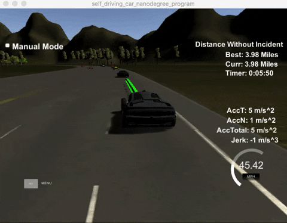
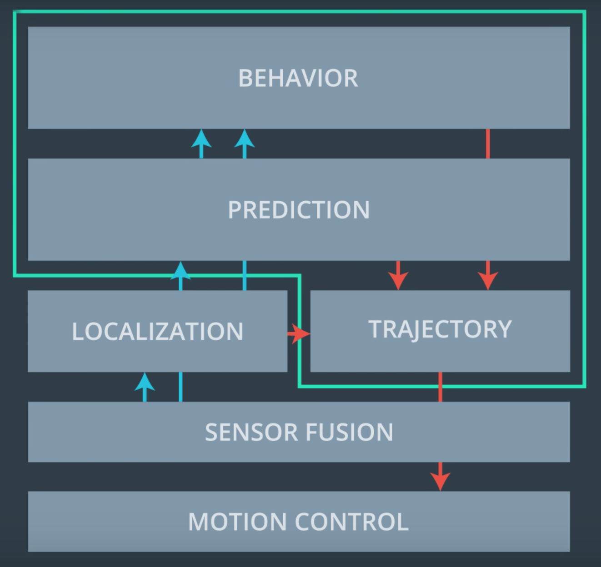

# Path Planning

Self-driving car path-planning on a highway.



## Overview
This project is part of [Udacity's Self-Driving Car Nanodegree program](https://www.udacity.com/drive)
and most of boiler-plate code comes from the program's lecture notes and quizzes.

A self-driving car on a simulated highway road is tasked with planning its path. The 
controller provided by the simulator makes sure that the waypoints are reached perfectly, 
with a time-interval of 0.02 seconds. The following constraints exist for the ego-car to 
drive on this road.

* Speed limit : 50 mph
* Total acceleration : 10 m/s^2
* Total jerk : 10 m/s^3

## Dependencies
* Udacity simulator : https://github.com/udacity/self-driving-car-sim/releases/tag/T3_v1.2
* uWebSockets : Only available for Mac OS and Ubuntu linux environments.
  * Mac OS : `sh install-mac.sh`
  * Ubuntu : `sh install-ubuntu.sh`  
* Cubic Spline Library : https://kluge.in-chemnitz.de/opensource/spline/ 
* CMake and Make build systems
* Compiler supporting C++11 standard 
  

## Build and Run
1. Start the simulator. 
2. From the parent directory, run the following. It builds and runs the `path_planning` binary. 
   ```bash
    sh run-path-planning.sh
    ```    

## Directory Layout
* src : Contains source related to behaviour-planning and path-planning. Also includes
`vehicle.cpp` class which encapsulates a vehicle's position and kinematic properties like speed, Frenet coordinates, lane ID, etc.   
* data : Has the global map information of the highway with details such as map's waypoint
coordinates.

## Path Planning
Let's go through the steps that the path-planner takes to navigate around the highway maintaining
its speed, acceleration, jerk and safety constraints. Please note that rest
of this document refers to the source in `src/` directory.

### Inputs
The path-planner is given the inputs of the ego-car's localisation data and the sensor-fused data 
containing the information of detected vehicles. 

The localisation data includes the following information of the ego-car.

* Global position : Both Euclidean (x, y) and Frenet (s, d) coordinates.
* Yaw
* Speed

The sensor-fusion data includes the below information of other detected vehicles.

* Vehicle ID
* Velocity in x and y direction
* Global position in Frenet coordinates

### Output
As an output, the path-planner provides the simulator with a set of waypoints to achieve.
These waypoints are computed using the approach described in the [next section](#methodology).

### Methodology

The approach taken to plan a path is broken down into three main steps: Prediction, Behaviour Planning, and Trajectory Planning. Each of these steps are described in the following sections referring to their
implementation in [main.cpp](src/main.cpp) file.

<figure>

<figcaption> Path Planning Components. Source: Udacity Self-driving car Nanodegree </figcaption>
</figure>

#### Prediction

Using the sensor-fusion input, the ego-car estimates the lane, position,
and the next position of nearby vehicles. This is implemented in lines [111-138](https://github.com/ashishraste/CarND-Path-Planning/blob/cebfd7c144c75a046b0db5d2f120be138ff7b122/src/main.cpp#L111).

First we create an instance of [Vehicle](src/vehicle.h) for each nearby vehicle detected.
Their projected coordinates are then calculated based on past trajectory
waypoints-size. This helps us in estimating their position while executing
the current trajectory. We then determine whether the detected vehicles are or 
would be in the same lane, left lane or in the right lane.

#### Behaviour Planning

In order to drive safely and under legal constraints, the ego-car decides 
the next _state_ it wants to be in given current situation and state. A simple
behaviour planner determining one among three states: {Keep Lane, Lane Change
Left, Lane Change Right} is implemented in lines [141-162](https://github.com/ashishraste/CarND-Path-Planning/blob/cebfd7c144c75a046b0db5d2f120be138ff7b122/src/main.cpp#L141). 

The situation that this step assesses is whether there are one (or more)
vehicle is in the ego-car's lane, or is in the left/right lanes. Based on
this information provided by the [Prediction](#prediction) step, the behaviour
planner picks the lane it wants the ego-car to be in. It does this by 
maintaining a _safe Frenet S distance_ of 30 metres from the nearby vehicles.
We also set a _car\_speed\_diff_ variable that is used to reduce the speed of 
the ego-car if it approaches a relatively slow-moving vehicle ahead quickly.

#### Trajectory Planning

The last step for the path-planner is to plan the trajectory with a set
of waypoints to achieve.

Based on the behaviour that the ego-car decides to achieve from the
[behaviour planning](#behaviour-planning) step, two points
from the last planned trajectory and three target points each 30, 60, 90
miles away respectively from the current position of the car are used to
create a spline trajectory. This is implemented in lines [167-186](https://github.com/ashishraste/CarND-Path-Planning/blob/cebfd7c144c75a046b0db5d2f120be138ff7b122/src/main.cpp#L169).

The trajectory-planner plans the waypoints in the local XY coordinate system of
the ego-car. Previous trajectory's points are added to the current list
for maintaining continuity, as shown in lines [104-108](https://github.com/ashishraste/CarND-Path-Planning/blob/cebfd7c144c75a046b0db5d2f120be138ff7b122/src/main.cpp#L104).
In the current trajectory we plan the path using the generated spline curve for 
a forward distance of 30 metres, and for a total of 50 waypoints including 
previous path's waypoints. Each waypoint is planned taking into consideration
the reference speed, _car\_speed\_diff_, the ego-car is recommended to travel
at as determined by the [behaviour planner](#behaviour-planning), and the
amount of time (and hence distance) it can take for the controller. 
Once the coordinates are planned, they are
converted back to global XY coordinates. This is implemented in lines
[195-216](https://github.com/ashishraste/CarND-Path-Planning/blob/cebfd7c144c75a046b0db5d2f120be138ff7b122/src/main.cpp#L195).

This step wraps up the path-planner where we have the next set of waypoints
for the controller to achieve.

---